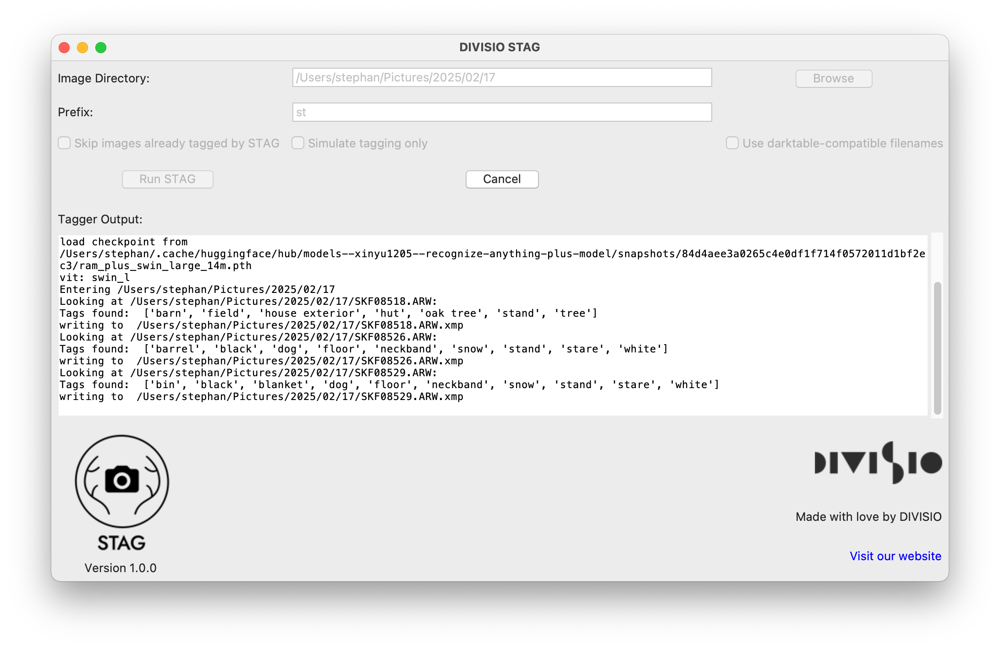

# STAG Documentation

## Introduction

STAG is an open source application designed for both amateur and professional photographers. Its primary function is to automatically tag batches of images by recursively traversing a given directory, analyzing the images and save the recognized tags into XMP sidecar files. 

STAG respects the integrity of your original image files, meaning they remain unaltered throughout the process.



## How It Works

### Image Processing

At the heart of STAG is a machine learning model sourced from [recognize-anything](https://github.com/xinyu1205/recognize-anything). This model is trained to recognize a wide range of objects and scenes within your images. *The model is running on your local machine, so no information about your images is being sent into the internet at any point.*

### Supported Image Formats

STAG is capable of handling a variety of image formats, including:

- RAW formats [from numerous camera manufacturers](https://www.libraw.org/supported-cameras) 
- JPEG
- TIF
- PNG
- HEIF

### Tagging and XMP Sidecar Files

- **XMP Sidecar Files**: XMP files are a standard format for storing metadata about images. They are commonly used in photography to store information like tags, ratings, and editing adjustments. When using STAG, tags are written into these XMP files, either by creating a new file or appending to an existing one.

- **Hierarchical Tags**: STAG writes tags in a hierarchical format with a user-defined prefix. This allows you to easily identify tags generated by STAG and, if necessary, remove them later. For example, if your prefix is "st", a tag might look like "st|cat".

## Installation and Usage

### Installation

STAG is distributed as a standalone application, thanks to PyInstaller. We offer pre-built binaries for Windows (amd64), macOS (arm64) and Linux (amd64).

To install STAG, simply download the binary for your platform from the [Releases Page](https://github.com/DIVISIO-AI/stag/releases) and unzip it at a convenient place.

**Important**: When running the tagger for the first time, STAG needs to download the recognize-anything model from huggingface in order to be able to run locally on your own machine only. As the model is 3.2GB in size, this process can take a few minutes. The model is only downloaded once.

### Usage

1. **Launch the Application**: Run the STAG executable for your operating system.
2. **Select Image Directory**: Use the graphical interface to browse and select the directory containing your images. 
3. **Set Tag Prefix**: Either accept the default ("st") prefix or enter a custom one. This helps in organizing and identifying STAG-generated tags.
4. **Choose Options**:
    - Decide whether to skip images that have already been tagged by STAG.
    - Opt to simulate the tagging process without making any changes (useful for testing).
    - Choose whether to use darktable-compatible filenames when *creating* XMP  files (see below)
5. **Run the Tagger**: Click the "Run STAG" button to start the tagging process.  The tagger recursively descends into chosen folder, scans for image files, creates tags and writes them into any XMP sidecar files found belonging to the image file.

6. **Cancel if Needed**: You can cancel the process if necessary using the "Cancel" button.

**Note**:
- if multiple XMP files are found (eg. 'PICT0001.xmp' and 'PICT0001.JPG.xmp', each XMP file is modified
- if no XMP file is found, a new XMP file is created


### Darktable and interoperability

#### The short version: 

If using darktable and tagging images *which don't have any XMP sidecar files already*, **make sure to check the "use darktable-compatible filenames" option.**

#### The long version:

Using STAG with already existing XMP files in an established workflow is perfectly safe and non-destructive.

Unfortunately, problems can arise if STAG has to create XMP file on its own. Although XMP is a standard, there can be subtle differences which makes exchanging metadata between multiple applications challenging.

For example, almost all applications generate a `PICT0001.XMP` sidedcar file for an image file that's named `PICT0001.JPG`.

Darktable however generates a sidecar file in the form `PICT0001.JPG.XMP`. Which of course is more logical, but can cause problems when exchanging image metadata with other programs. To add insult to injury, darktable is able to read metadata in the form of `PICT0001.xmp` but has the habit of writing a new metadata file of its own when importing from such files.

So to stay clear of any source of chaos, it's highly recommended to check the "use darktable-compatible filenames" checkbox when working with darktable.

## FAQ

### I'm very skeptical about allowing an AI to look at my images. Can you guarantee that STAG isn't sending my stuff to Sam Altman?
Yes, we can. Once STAG has downloaded the recognize-anything model from huggingface, everything is running locally on your computer. You can verify this by yourself by disconnecting your computer from the internet and running STAG. It will still work.

### But isn't using AI bad for the environment?
It's important to understand that not everything utilizing AI has to do with LLMs running on multi-billion dollar server farms owned by billionaires. STAG uses a very small convolutional neural network (CNN) which does not even need a GPU to run fast and efficiently. You can run STAG on a perfectly normal computer and not draw more power than your Adblocker needs for making the internet bearable.

### I don't want your fancy GUI. Don't you have a command line tool?
Of course. "stag.py" can be called from the command line. Its usage is:
```
stag.py [-h] [--prefix STR] [--force] [--test] [--prefer-exact-filenames] DIR
```
where
- `force` forces STAG to write tags even if there are already tags with the given prefix
- `test` instructs STAG not to write any changes to disc
- `prefer-exact-filenames` creates xmp files with complete ("x.jpg.xmp") filenames.


### Why is it called STAG?
Because Stephan wrote it. It's Stephan's tagger, or STAG for short.


## Local development

Prerequisites: Python3.1

Create a virtual environment (highly recommended):

    python3 -m venv stag_env

Activate it:

    source stag_env/bin/activate

Install Dependencies

    pip install -r requirements.txt

...and start hacking away. For example, run the command line tool for testing:

    see usage above, ./stag.py myImages

or build an executable for your platform:

    makeExecutable.sh linux

(please be aware that pyinstaller provides no cross-platform functionality. If you want to build a windows version, you have to do it in a windows environment. I know it hurts, but it's doable.)


## Licensing and Contribution

STAG is licensed under the Apache-2.0 license, meaning it is open source and freely available to the community. Contributions are welcome, and users are encouraged to explore the source code, suggest improvements, and report issues.

For more information, updates, or to contribute, visit our website at [divis.io](https://divis.io).
